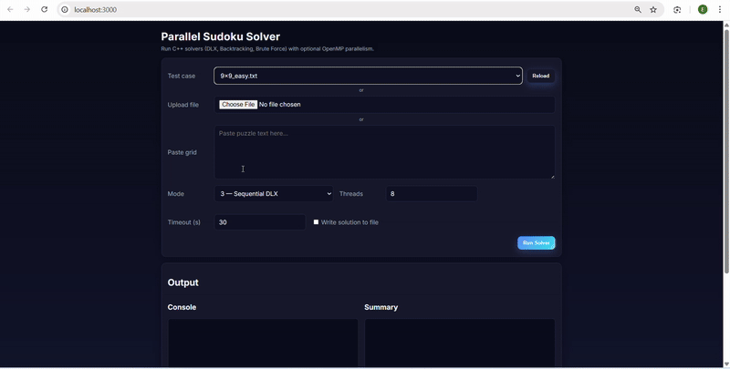

# Parallel Sudoku Solver

A high-performance Sudoku solver with multiple solving algorithms and parallel processing support.

## Features
- Multiple solving algorithms (DLX, Backtracking, Brute Force, Forward Checking)
- Parallel processing with OpenMP
- Web interface for easy solving
- Support for various grid sizes (9x9, 16x16, 25x25)

## Demo



[▶ Watch Full Demo Video](demo/sudokoapp_demo.mp4)

## Quick Start

### Prerequisites
- C++17 compatible compiler
- CMake 3.10+
- OpenMP

### Build & Run
```bash
make -j8
./sudoku_main Test_Cases/9x9_easy.txt 3
```

## Web Interface
```bash
cd web
npm install
npm start
```
Then open `http://localhost:3000`


## License
MIT - See [LICENSE](LICENSE) for details.
 

